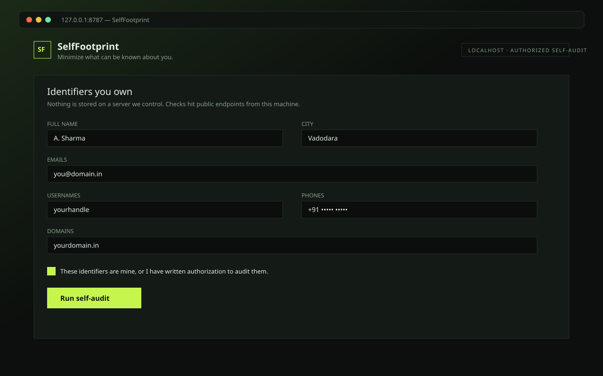
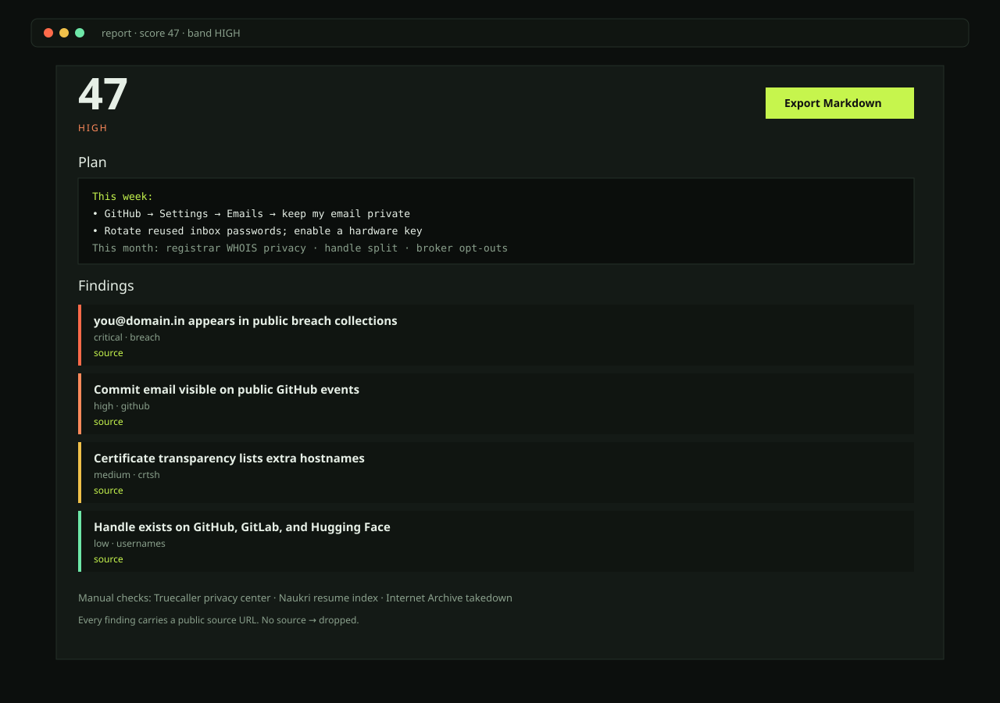
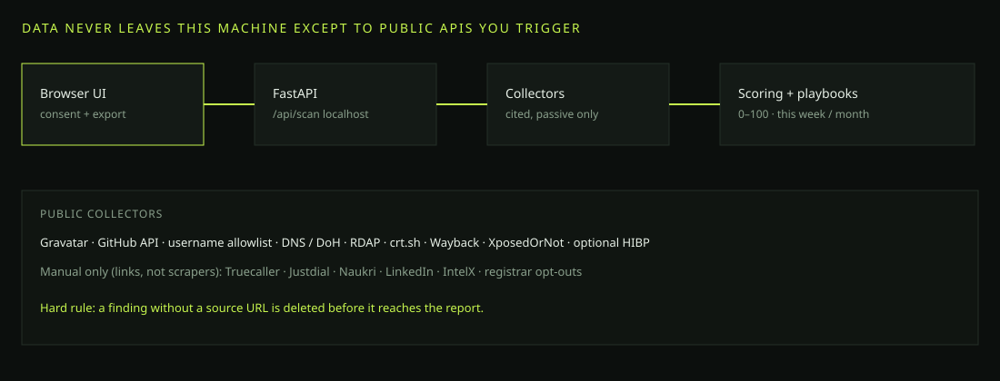

<p align="center">
  
</p>

<h1 align="center">SelfFootprint</h1>
<p align="center"><strong>Minimize what can be known about you.</strong></p>

<p align="center">
  Local-first, authorized <em>self-audit</em> for people and small units.<br/>
  Map the public traces your own identifiers leave. Score the exposure. Get a plan you can finish this week.
</p>

<p align="center">
  <a href="LICENSE"></a>
  <a href="ETHICS.md"></a>
  
  
  
</p>

<p align="center">
  <a href="#quick-start">Quick start</a> ·
  <a href="#what-it-does">What it does</a> ·
  <a href="#screenshots">Screenshots</a> ·
  <a href="ETHICS.md">Ethics</a> ·
  <a href="#faq">FAQ</a>
</p>

---

## Why this exists

Most OSINT tools are built for operators looking **outward**. SelfFootprint is built for the person looking **inward**.

It answers three questions:

1. What can a stranger reconstruct from *my* email, handle, phone, and domain?
2. Which of those traces actually matter in an Indian context (Truecaller, Naukri, Justdial, court PDFs, resume indexes)?
3. What do I delete, lock, or rotate **this week**?

It is not a stalking kit. There is no “investigate anyone” mode. The consent checkbox is not decorative — the API rejects the request without it.

## Screenshots

### 1. You declare identifiers you own


### 2. You get a scored report and a plan



### 3. How the pieces fit



> Want a live walkthrough? Record a 60–90s clip of your own self-scan and drop it at [`docs/demo.mp4`](docs/demo.mp4).

## Quick start

### Linux / macOS

```bash
git clone https://github.com/Geneticscrol/selffootprint.git
cd selffootprint
python3 -m venv .venv
source .venv/bin/activate
pip install -r requirements.txt
cp .env.example .env
python -m uvicorn app.main:app --reload --host 127.0.0.1 --port 8787
```

### Windows (PowerShell or Scoop Python)

```bat
git clone https://github.com/Geneticscrol/selffootprint.git
cd selffootprint
python -m pip install -r requirements.txt
python -m uvicorn app.main:app --reload --host 127.0.0.1 --port 8787
```

Open [http://127.0.0.1:8787](http://127.0.0.1:8787). Tick the consent box. Scan **your** identifiers.

### Docker

```bash
cp .env.example .env
docker compose up --build
```

## What it does

Collectors are passive, public, or operator-initiated. People-search sites that forbid scraping are **links you open**, not bots we run.

| Collector | Input | Result |
|---|---|---|
| Gravatar | email | Public avatar tied to the email hash |
| GitHub | email or username | Public profile fields, commit emails on public events |
| Username probe | handle | Existence check on a small allowlist |
| DNS / DoH + RDAP | domain | Records and whether a registrant role is still published |
| crt.sh | domain | Extra hostnames from certificate transparency |
| Wayback CDX | domain | Whether the Archive still has snapshots |
| XposedOrNot | email | Public breach collections (no key) |
| Have I Been Pwned | email | Optional, needs `HIBP_API_KEY` |
| India + global brokers | name / phone / email | Search + opt-out URLs |
| Public PDFs | full name | Operator-opened `filetype:pdf` searches. Files are not downloaded. |
| Unit pack | team handles | Flags a handle that appears more than once on an authorized roster |

Every finding must include a `source` URL. The scorer drops anything that does not.

### Re-scan diffs

Each scan is fingerprinted from the identifiers you entered and stored locally in `scans/<fingerprint>.json` (gitignored). The next run on the same set shows **added / removed / unchanged** finding IDs.

### Signed HTML report

The UI exports Markdown (`/api/scan.md`) and a signed HTML file (`/api/scan.html`). The signature is HMAC-SHA256 over fingerprint + score + finding IDs, keyed by `REPORT_SIGNING_KEY` or a generated `scans/.signing_key`.

## What it refuses to do

Read [`ETHICS.md`](ETHICS.md) before you add a collector.

- No third-party targeting UI
- No face search
- No scraping Truecaller, Facebook, Instagram, Naukri, or data brokers
- No dark-web crawling
- Default bind address is `127.0.0.1`

## Configuration

| Variable | Required | Purpose |
|---|---|---|
| `HIBP_API_KEY` | no | Official Have I Been Pwned v3 key |
| `OLLAMA_URL` | no | e.g. `http://127.0.0.1:11434` |
| `HOST` / `PORT` | no | keep `127.0.0.1` / `8787` |
| `REPORT_SIGNING_KEY` | no | HMAC key for signed HTML |

## Roadmap

- [x] Local web UI + consent gate
- [x] Cited collectors + Markdown export
- [x] India broker / opt-out pack
- [x] DNS works without `dnspython`
- [x] Re-scan diff vs last local snapshot
- [x] Unit pack: shared-handle collision
- [x] Public-PDF search pack (links only)
- [x] Signed HTML report (HMAC-SHA256)
- [ ] 90-second demo video in `docs/demo.mp4` (record locally)

## License

Apache License 2.0. See [`LICENSE`](LICENSE).
